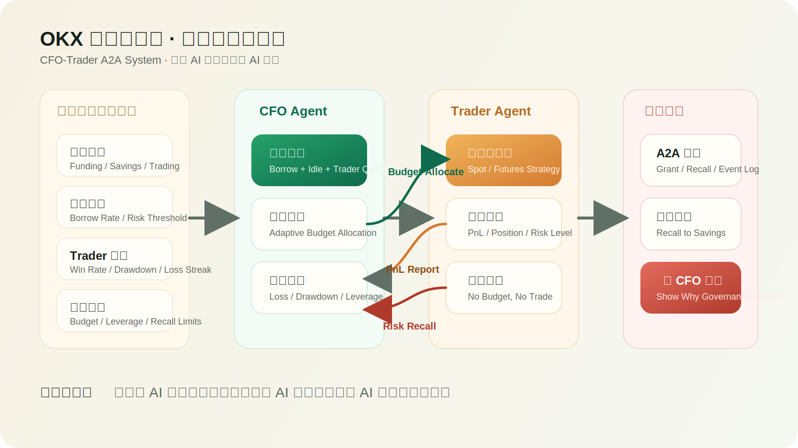
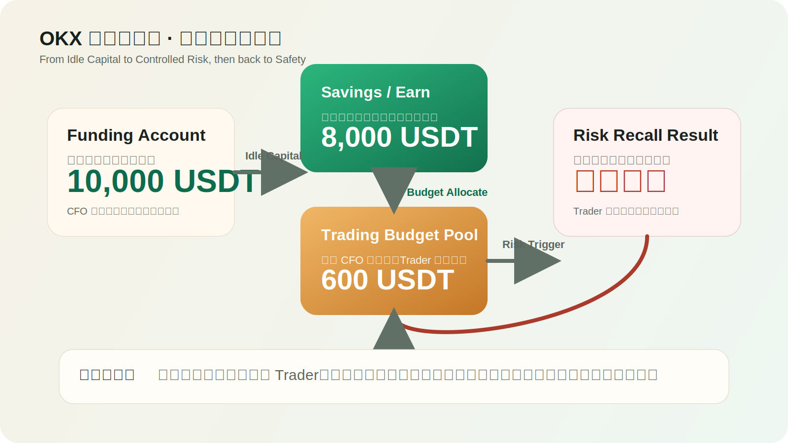
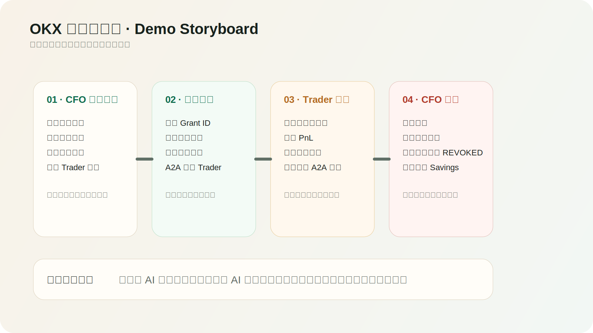

# OKX 财管双子星

`OKX 财管双子星` 是一个双 Agent 资金治理原型，英文副标为 `CFO-Trader A2A System`。

它把“谁来管钱”和“谁来交易”拆成两个独立角色：

- `CFO Agent`：负责账户健康评估、自适应预算审批、风险监控与资金回收
- `Trader Agent`：负责在授权预算内执行策略，并持续回报 PnL、风险状态和仓位变化

核心目标不是做一个更激进的交易机器人，而是把交易过程变成一条可治理、可回放、可审计的资金管理流程。

## Repository Overview

这个仓库包含：

- 一个本地可运行的 CLI Demo
- 一个可视化 Web Console
- 一个可替换的数据提供层
- 一组用于 README / 文档 / 作品页的系统示意图

## Architecture







## Core Concepts

### 1. Budget First

Trader 不能直接使用全部账户资金。任何策略执行都必须先经过 CFO 的预算审批。

### 2. Governance Over Execution

系统关注的不只是“怎么下单”，更重要的是：

- 这笔钱该不该进入风险敞口
- 应该给多少预算
- 风险触发后是否应当立即回收

### 3. A2A With State

两个 Agent 不是简单对话，而是通过共享账本协作。预算授权、交易回报、回收动作都会写入 `ledger.json`。

## Quick Start

运行风险回收场景：

```bash
python3 app.py --mode simulated --scenario loss_recall
```

运行盈利持有场景：

```bash
python3 app.py --mode simulated --scenario profit_lock
```

预览本地快照提供层：

```bash
python3 app.py --preview-provider local-demo --scenario loss_recall
```

## Web Console

启动本地控制台：

```bash
python3 web_console.py
```

然后访问 [http://127.0.0.1:8080](http://127.0.0.1:8080)。

控制台内置：

- `自动播放全流程`
- `路演模式`
- `全屏展示版`
- `执行证据 / 资金流向 / 无 CFO 对照`

## Optional OKX Demo API Bridge

如果你想单独测试 OKX Demo Trading API，可启动本地代理：

```bash
python3 okx_demo_api.py
```

如果想读取真实账户快照：

```bash
export OKX_API_KEY=...
export OKX_SECRET_KEY=...
export OKX_PASSPHRASE=...
export OKX_DEMO=1
python3 app.py --mode okx
```

## Project Structure

- `app.py`: CLI runner and simulation flow
- `providers.py`: local demo and OKX snapshot providers
- `web_console.py`: local HTTP server for the demo console
- `web/`: frontend assets
- `scenarios.json`: scripted scenarios
- `ledger.json`: shared system state
- `docs/prd.md`: product and system design notes
- `docs/runbook.md`: demo and testing notes
- `docs/local_demo_mode.md`: local-first workflow
- `docs/diagrams.md`: diagram index

## Current Status

- Local demo path is stable and reproducible
- Web console is optimized for presentation and walkthroughs
- OKX provider is preserved as an extension path
- Demo API integration may still depend on OKX-side permission availability
